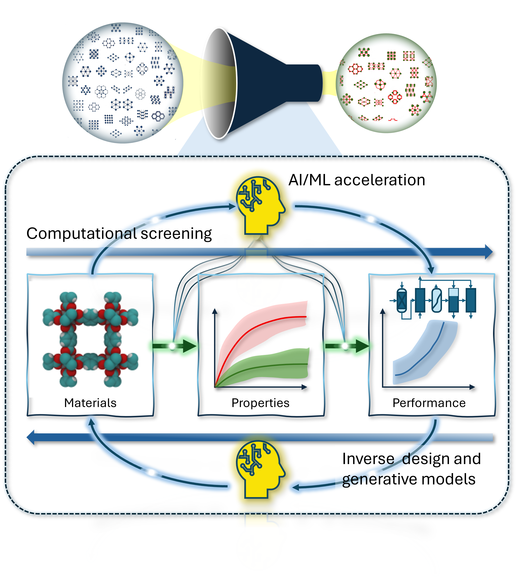

<!-- Can we accurately screen MOFs for carbon capture applications using high throughput computational screening workflows?    -->

<!--more-->

Why don't you write a short perspective on adsorption of water in MOFs, they said. Short, fun project, I thought. 15 journal article pages later, I think I said all I wanted to say on the matter. 

Let it be a lesson for any journal who asks me for a brief comment.

Now in Langmuir:

https://doi.org/10.1021/acs.langmuir.6c01647

<figure>
  
  <figcaption>Fig.1 - Concepts in computational screening of MOFs. The objective of computational screening is to use computational methods to identify the most promising MOFs for a specific application (top). The screening process typically follows a workflow that progresses from material structure to material properties and ultimately to process-level performance (bottom). In generative models, this workflow can be reversed to enable inverse design of MOFs starting from a target performance. Artificial intelligence and machine learning methods can accelerate individual stages of forward and reverse workflows or, in some cases, bypass them altogether.>
</figure>

What is the main message? Water adsorption in MOFs remains one of the most challenging problems for both experimentalists and theoreticians. In this Perspective, I wanted to discuss the origins of these challenges, highlight the fundamental insights that can be gained from molecular simulations, and argue for the need for a coherent and collaborative effort between the experimental and simulation communities to bring the computational design of MOFs for water applications closer to practical realization and impact. Let us see if it has an impact!

